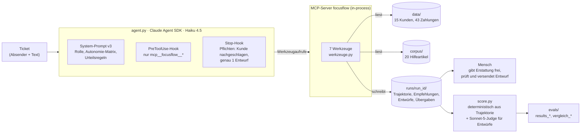

# UC4 — Agents mit MCP: Support-Agent mit Freigaberegeln

## Kurzfassung

**Die Frage:** Ein KI-Agent soll Support-Tickets einer App nicht nur beantworten, sondern auch handeln, zum Beispiel ein Abo kündigen oder eine Erstattung anstoßen. Wie viel darf er allein tun? Und wie findet man das mit Daten heraus statt aus dem Bauch? Gemessen wurde an 15 realistischen Tickets mit erfundenen Kundendaten, je Ticket 3 Durchläufe, in drei Versionen des Agents.

**Was dabei herauskam:**

1. **Die Autonomie wird pro Aktion festgelegt, nicht pauschal.** Lesen und an einen Menschen übergeben darf der Agent immer, ein Abo kündigen darf er allein. Erstattungen darf er nur *empfehlen*, und Antworten an Kunden speichert er nur als *Entwurf*. Erstattungen laufen im **Schattenmodus**: Der Agent empfiehlt, ein Mensch entscheidet, und gemessen wird, wie oft die Empfehlung richtig gewesen wäre. So lässt sich später mit Daten entscheiden, ob er mehr Freiheit bekommt.
2. **Maßstab ist, ob ein Ticket immer klappt, nicht ob es einmal klappt.** Der Agent löst 87 % der einzelnen Durchläufe. Aber nur bei 73 % der Tickets klappen alle drei Durchläufe (pass^3). Für einen Kunden zählt die zweite Zahl, denn er bekommt nicht den besten von drei Versuchen.
3. **Anweisungen im Prompt stoßen an Grenzen. Was immer gelten muss, gehört in den Code.** Neue Prompt-Regeln haben einzelne Tickets verbessert und andere verschlechtert. Eine Regel, die Vermutungen verbietet, hat messbar nichts bewirkt. Verlässlich wurde es erst, als der Code die Pflichten erzwingt („erst Kunde nachschlagen, immer einen Entwurf ablegen“). Wie oft der Code eingreifen musste, wird offen mitgezählt (7 % der Durchläufe).
4. **Rund 40 % der Antwortentwürfe enthalten Unbelegtes,** also vermutete Ursachen, erfundene Fristen von Apple oder Google und Zusagen wie „wir melden uns noch heute“. Deshalb prüft ein Mensch jeden Entwurf vor dem Versand. Das bleibt so.
5. **Null Fehler bei Erstattungen, aber zu wenige Fälle für mehr Autonomie.** In 135 Durchläufen hat der Agent nie falsch empfohlen und nie eine nötige Erstattung übersehen. Diese Durchläufe beruhen aber auf nur 15 verschiedenen Tickets, davon 3 mit berechtigter Erstattung. Statistisch lässt sich damit nur sagen, dass die Fehlerquote bei höchstens 25 % bzw. 100 % liegt. Für eine Freigabe bräuchte es mindestens 30 unabhängige Erstattungsfälle.

**Kosten und Tempo:** 27 USD pro 1000 Tickets, eine Antwort dauert typisch 26 s, in 95 % der Fälle höchstens 37 s. Das ganze Projekt hat 6,68 USD an API-Kosten verursacht (mehr als geplant, siehe [Kosten](#kosten--latenz)).

**Wie belastbar ist das?** 15 Tickets mit je 3 Durchläufen sind eine kleine Stichprobe. Unterschiede von 2–3 Durchläufen zwischen Versionen sind Tendenzen, keine Beweise.

---

## Problem

Die fiktive Habit-Tracker-App **FocusFlow** (aus [UC3](https://github.com/JulianStnDev/ai-uc-03-context-engineering)) bekommt Support-Tickets zu Abo, Zahlungen und Konto. Ein Agent soll sie bearbeiten: den Kunden identifizieren, Zahlungen prüfen, die Regeln in der Hilfe nachlesen und dann handeln, also kündigen, eine Erstattung empfehlen, an einen Menschen übergeben oder eine Antwort entwerfen.

Die eigentliche Produktfrage ist nicht, *ob* der Agent das kann, sondern **welche Aktionen er ohne Menschen ausführen darf**. Falsch zu antworten lässt sich korrigieren. Eine falsche Erstattung kostet Geld, und eine versendete Nachricht ist nicht zurückholbar.

Die Testdaten enthalten gezielt schwierige Fälle:
- eine echte und eine nur behauptete Doppelabbuchung;
- ein Jahresabo innerhalb der 14-Tage-Frist, eines außerhalb und eine Verlängerung;
- Käufe über Apple und Google, die FocusFlow nicht erstatten kann;
- einen Kunden mit zwei Konten, der für das jeweils andere Konto etwas verlangt;
- einen Kunden, der eine Zahlung behauptet, die es nicht gibt.

Details stehen in [docs/DATA_NOTES.md](docs/DATA_NOTES.md). Die Datei ist nur für Menschen und gelangt nie in den Kontext des Agents.

Adressat ist, wer entscheiden muss, wie viel Handlungsfreiheit ein Support-Agent bekommt und wie man diese Entscheidung absichert.

## PM-Entscheidung

**Autonomie pro Aktion nach Risiko und Umkehrbarkeit** statt „alles autonom“ oder „alles mit Freigabe“:

| Aktion | Werkzeug | Autonomie | Warum |
|---|---|---|---|
| Kunde, Zahlungen, Hilfe lesen | `kunde_nachschlagen`, `zahlungen_ansehen`, `hilfe_durchsuchen` | immer | keine Außenwirkung |
| An Mensch übergeben | `an_mensch_uebergeben` | immer | Die sichere Richtung |
| Abo kündigen | `abo_kuendigen` | allein (nur Web-Abos, auf ausdrücklichen Wunsch) | praktisch umkehrbar: Pro läuft bis Periodenende, Neuabschluss jederzeit |
| Erstattung | `erstattung_empfehlen` | **nur Empfehlung**, Mensch gibt frei (Schattenmodus) | bewegt Geld, Regeln mit Fallen |
| Antwort an Kunden | `antwort_entwerfen` | **nur Entwurf** | nicht zurückholbar, Qualität erst zu messen |

Weitere Entscheidungen, alle in [docs/decisions.md](docs/decisions.md):
- **Durchsetzung strukturell, nicht per Prompt.** Es gibt kein Werkzeug, das Geld bewegt oder Nachrichten versendet. Ein Hook lehnt jedes Werkzeug außerhalb des eigenen MCP-Servers ab. Ab v3 erzwingt ein zweiter Hook die Pflichten.
- **Grundsatz ab v3:** Pflichten, die immer gelten, stehen im Code. Urteile, also wann übergeben oder ob erstattet wird, stehen im Prompt.
- **Eigener MCP-Server in-process** statt als separater Prozess. Die Werkzeuge sind damit ohne LLM testbar (83 Tests).
- **Modell Haiku 4.5** wie in UC1–UC3, explizit gesetzt, mit Kostendeckel `max_budget_usd` pro Durchlauf.
- **Abrechnung nur per API-Key**, nie über das Claude-Abo. Ohne Key bricht das Skript ab. Nur so sind Kosten pro Durchlauf exakt messbar.
- **Goldset-Konflikte werden entschieden, nicht wegdefiniert.** Bei T02 widersprachen sich System-Prompt und Goldset. Entschieden wurde fürs Goldset, und T02 zählt ehrlich als Fehler. Bei T07 war das Soll zu eng und wurde mit Zahlen vorher/nachher korrigiert.

## Architekturskizze



Jeder Werkzeugaufruf, auch fehlerhafte und blockierte, landet mit Zeitstempel in `trajektorie.jsonl`. Daraus werden fast alle Eval-Kriterien deterministisch berechnet. Die Grunddaten in `data/` bleiben unverändert, jeder Durchlauf hat seinen eigenen Ausgabeordner.

## Evaluationsergebnisse

**Aufbau:** 15 Tickets ([evals/aufgaben.json](evals/aufgaben.json)) × 3 Durchläufe je Version. Pro Ticket legt das Goldset fest:
- Pflichtwerkzeuge und verbotene Aktionen; schon der Versuch einer verbotenen Aktion zählt;
- die Soll-Erstattung (Zahlung und Betrag) oder „keine“;
- ob übergeben werden muss (ja, nein oder optional);
- **genau eine** Kernaussage für den Entwurf (Lehre aus UC3).

**Kriterien:** `pflicht_ok`, `verboten_ok`, `erstattung_ok` und `uebergabe_ok` werden deterministisch aus der Trajektorie berechnet. `entwurf_ok` (Kernaussage enthalten) und `keine_spekulation` (jede Behauptung durch Daten oder Hilfe gedeckt) bewertet ein Judge (Sonnet 5), der den ganzen Durchlauf als Kontext sieht. Ein Durchlauf gilt als erfolgreich, wenn die fünf Kriterien ohne `keine_spekulation` erfüllt sind. „Streng“ verlangt zusätzlich `keine_spekulation`.

| | v1 | v2 | v3 |
|---|---|---|---|
| Was sich ändert | Ausgangsprompt | + 3 Prompt-Regeln | v1 + 2 Regeln aus v2 + **Pflichten per Stop-Hook** |
| Erfolg pro Durchlauf | 82 % | 78 % | **87 %** |
| **pass^3** (alle 3 Durchläufe eines Tickets erfolgreich) | 73 % | 73 % | **73 %** |
| pflicht_ok / verboten_ok / erstattung_ok | 98 / 100 / 100 % | 93 / 100 / 100 % | 100 / 100 / 100 % |
| uebergabe_ok / entwurf_ok | 91 / 82 % | 93 / 82 % | 93 / 87 % |
| keine_spekulation ¹ | 64 % | 58 % | 58 % |
| Erfolg streng / pass^3 streng | 60 / 40 % | 53 / 40 % | 56 / 33 % |
| Durchläufe mit Pflicht-Eingriff durch den Code | – | – | 7 % (3/45, alle T14) |

¹ **Der Wert ist eher zu streng.** Es gibt mindestens 5 bekannte Fehlurteile, weil der Judge (Fassung j2) das heutige Datum nicht kannte und Schlüsse wie „die 14-Tage-Frist ist abgelaufen“ deshalb als Spekulation wertete. Der Fix steckt im Judge (Fassung j3), die veröffentlichten Werte wurden aber aus Kostengründen nicht neu bewertet.

**Was die Versionen zeigen** (Details, Kopplungseffekte und ausgeschriebene Fallbeispiele in [evals/vergleich_v1_v2_v3.md](evals/vergleich_v1_v2_v3.md)):
- **Prompt-Regeln haben Nebenwirkungen.** Die Regel „fremdes Konto → übergeben“ hat T14 in v2 zwar richtig entscheiden lassen, wirkte aber als Abkürzung: kein Nachschlagen, kein Entwurf, dadurch 0/3. Eine Regel für T02 hat T02 nicht verbessert, aber T07 verschlechtert.
- **Der Code fängt ab, was der Prompt nicht schafft.** In v3 erzwingt der Stop-Hook bei T14 in allen drei Durchläufen das Nachschlagen, einmal auch den Entwurf. Die Verbesserung von T14 kommt vollständig daher. Das Agent-Verhalten selbst hat sich nicht geändert.
- **Die Regel „nichts vermuten“ wirkt nicht messbar.** `keine_spekulation` bleibt bei ~60 %. Spekuliert wird vor allem über die Abläufe bei Apple und Google, über Ursachen und in konkreten Zeitzusagen.
- **T02 (behauptete Doppelabbuchung) bleibt in allen Versionen bei 0/3.** Der Agent übergibt, statt selbst zu klären, obwohl die Hilfe den Widerspruch erklärt (Vormerkung der Bank).

**Schattenmodus Erstattung:** 0 Fehler in 135 Durchläufen, über alle drei Fehlerarten. Obergrenze der Fehlerquote (95 %, Dreierregel) auf Ticket-Ebene: **≤ 25 %** für „fälschlich empfohlen“ (0/12 Tickets) und **≤ 100 %** für „fälschlich nicht empfohlen“ (0/3 Tickets). Die 3 Durchläufe eines Tickets sind nicht unabhängig. Deshalb zählt die Ticket-Ebene, und mehr Durchläufe derselben Tickets verbessern die Grenze nicht. **Das reicht nicht für eine Autonomie-Freigabe.**

**Judge-Kalibrierung:** Alle 15 negativen Urteile der ersten Judge-Fassung habe ich von Hand gegen die Daten geprüft ([evals/judge_pruefung.md](evals/judge_pruefung.md)): 14 korrekt, 1 Fehlurteil (T01, mehrdeutige Kernaussage). Daraufhin bekam der Judge den ganzen Durchlauf als Kontext.

## Kosten & Latenz

Pflichtzahlen (v3, Standardversion):
- **Kosten pro 1000 Requests: 27,0 USD** (ein Request = ein Ticket, im Mittel 4,4 Werkzeugaufrufe, Haiku 4.5)
- **p95-Latenz: 37,0 s pro Ticket** (p50 26,4 s). Davon entfallen ca. 1,5 s auf Start und Ende des SDK, der Rest auf die Agent-Schleife.
- **Qualitätsmetrik: pass^3 = 73 %** (Erfolg pro Durchlauf 87 %)

Die Latenz stammt fast vollständig aus der Agent-Schleife selbst. Eine frühe Annahme von mir, ca. 10 s seien SDK-Start, war nur aus Zeitstempeln geschlossen und falsch. Die Messung hat sie widerlegt.

**Gesamtkosten des Projekts: 6,68 USD**

| Schritt | Schätzung vorab | Tatsächlich |
|---|---|---|
| v1: Probelauf + 45 Durchläufe + Judge | 1–2 USD | 1,38 USD |
| v2: 45 Durchläufe + Judge | ca. 1,35 USD | 1,36 USD |
| v3: Probelauf + 45 Durchläufe | ca. 1,40 USD | 1,25 USD |
| Neubewertung v1–v3 mit Judge j2 (Durchlauf als Kontext) | **nicht geschätzt** | **2,69 USD** |
| **Gesamt** | | **6,68 USD** |

Der Judge mit Durchlauf-Kontext kostet ca. 0,02 USD pro Urteil statt 0,003 USD, weil Hilfeartikel und Zahlungen mitgeschickt werden. Die Neubewertung war beauftragt, ihre Kosten habe ich aber nicht vorher geschätzt, und der v3-Schritt kam auf ca. 3,95 statt ca. 1,40 USD. **Neue Regel: erst schätzen, dann laufen.** Das gilt für jeden bezahlten Schritt, auch für Neubewertungen durch den Judge.

## Grenzen

- **Erfundene Daten, 15 Tickets, 3 Durchläufe.** Unterschiede zwischen Versionen liegen oft bei 2–3 Durchläufen.
- **Nur 3 Tickets mit berechtigter Erstattung.** Für die Autonomie-Frage ist das viel zu wenig (siehe oben).
- **Der Judge ist selbst ein Modell.** `entwurf_ok` hat sich als stabil erwiesen (3 von 88 Urteilen kippten beim Wechsel der Fassung). `keine_spekulation` ist durch die Datumslücke nach unten verzerrt.
- **Ein Modell, eine Temperatur.** Ob ein größeres Modell weniger spekuliert, ist nicht gemessen.
- **Das Goldset wurde zweimal nach einem Lauf angepasst** (T01 im Wortlaut, T07 in der Sache), beide Male dokumentiert und mit Zahlen vorher/nachher.

## Learnings

1. **pass^k statt Einzelerfolg.** 87 % Erfolg pro Durchlauf klingt gut, aber jedes vierte Ticket scheitert in mindestens einem von drei Versuchen. Bei Agents, die handeln, ist die Streuung das eigentliche Risiko.
2. **Prompt-Regeln sind gekoppelt.** Jede neue Regel hat ein Ziel-Ticket verbessert und ein anderes verschlechtert, oder sie hat gar nicht gewirkt. Ohne Vergleich je Ticket wäre das im Durchschnitt untergegangen.
3. **Pflichten gehören in den Code, und die Eingriffe gehören in die Auswertung.** Der Stop-Hook macht den Agent verlässlich, verdeckt aber, dass der Agent selbst nicht besser geworden ist. Erst die Kennzahl „Pflicht erfüllt ohne Eingriff“ macht das sichtbar.
4. **Bevor man den Agent verbessert, das Soll prüfen.** T02 war ein Konflikt zwischen Prompt und Goldset, T07 ein zu enges Soll, T01 eine mehrdeutige Kernaussage. Keiner der drei Fälle war ein reiner Agent-Fehler.
5. **Ein Judge braucht denselben Kontext wie der Agent.** Ohne Daten verlangte er 108,68 statt 54,34 USD. Ohne das Datum wertete er korrekte Fristschlüsse als Spekulation. Die negativen Urteile von Hand gegenzuprüfen, hat beides aufgedeckt.
6. **Null Fehler heißt nicht sicher.** Die Dreierregel übersetzt „0 von n“ in eine ehrliche Obergrenze. Bei 3 Erstattungs-Tickets liegt sie bei 100 %.
7. **Messen statt schließen, schätzen statt laufen lassen.** Die Annahme zum SDK-Overhead war falsch, und die Kosten der Neubewertung waren nicht geschätzt. Beides kam erst durch Messung bzw. Abrechnung ans Licht.

## Was ich anders machen würde

- **Das Goldset auf die Autonomie-Frage zuschneiden:** mindestens 30 verschiedene Erstattungsfälle statt 3, sonst kann der Schattenmodus die Frage nicht beantworten.
- **Kernaussagen mit Datenbezug formulieren** („die zweite Zahlung Z005 über 54,34 USD“) und das Goldset vor dem ersten Lauf gegen die Hilfe prüfen.
- **Den Judge vor dem ersten Lauf kalibrieren:** Kontext wie beim Agent (Durchlauf und Datum), `keine_spekulation` von Anfang an, Stichprobe von Hand prüfen.
- **Pflichten ab v1 im Code** und die Eingriffe als Kennzahl, statt sie erst per Prompt zu versuchen.
- **Vor jedem bezahlten Schritt eine Kostenschätzung**, auch für Neubewertungen.

## Benutzung

```bash
uv venv && uv pip install --python .venv -r requirements.txt
cp ../ai-uc-03-context-engineering/.env .   # ANTHROPIC_API_KEY, gitignored
.venv/bin/python -m pytest                   # 83 Tests, ohne LLM

# Agent (kostet Geld, vorher schätzen: ca. 0,027 USD pro Ticket)
.venv/bin/python agent.py T01                                   # ein Ticket, Prompt v3
.venv/bin/python agent.py --alle --laeufe 3 --prompt v3 --ausgabe evals/laeufe/v4

# Auswertung
.venv/bin/python score.py evals/laeufe/v3 --judge-version j2   # veröffentlichte Werte, ohne API-Aufrufe
.venv/bin/python score.py evals/laeufe/v4                      # neuer Lauf: Judge j3, ca. 0,02 USD pro Urteil
.venv/bin/python compare.py v1 v2 v3 --fall "T14:anderes Konto" --fall "T02:widersprechen" \
    --einordnung evals/einordnung_v1_v2_v3.md
```

| Datei | Inhalt |
|---|---|
| `werkzeuge.py`, `mcp_server.py` | 7 Werkzeuge, Protokoll je Aufruf, MCP-Hülle |
| `agent.py` | Agent (Prompts v1–v3, PreToolUse- und Stop-Hook) |
| `score.py`, `compare.py` | Auswertung, Vergleich, Fallbeispiele |
| `evals/` | Goldset, Durchläufe mit Trajektorien, Ergebnisse, Judge-Prüfung |
| `docs/decisions.md` | alle Entscheidungen, datiert |
